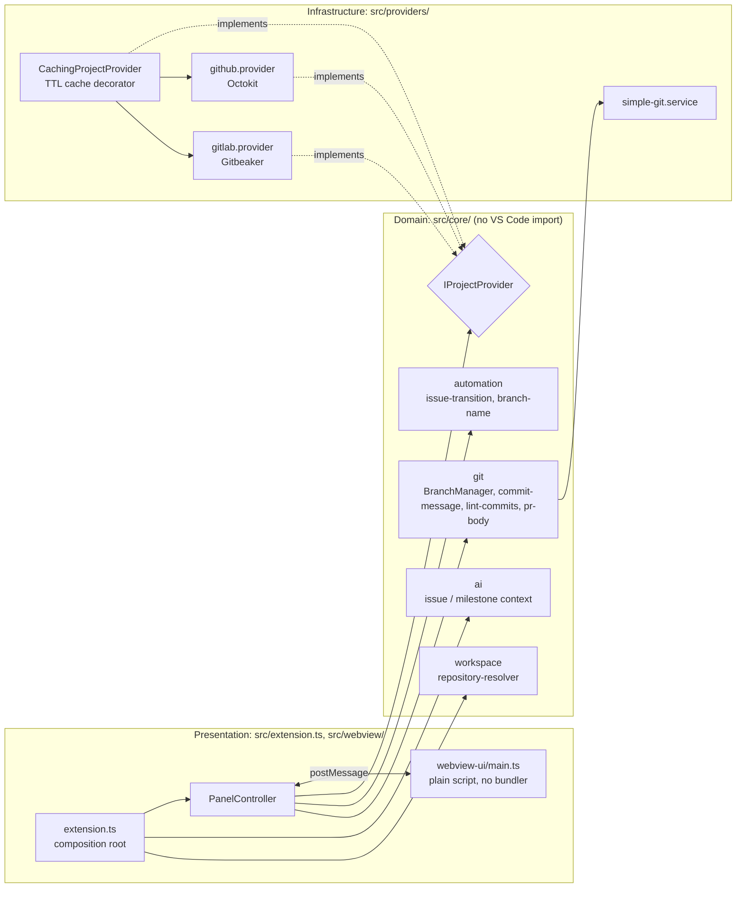

# Remote Project Manager

> A VS Code extension that manages GitHub and GitLab Issues and Milestones from one panel, and creates the git branch for you when you start an issue — for developers who want to stay in the editor.

<!-- TODO Vincent : add a 10 s GIF or screenshot of the central panel. -->
<!-- TODO Vincent : no Marketplace badge on purpose: package.json has `"publisher": "local-dev"` and the README documents installation from a `.vsix`, so nothing in the repo says it is published. -->

[](https://github.com/vincent-agi/remote-project-manager-vscode/actions/workflows/ci.yml)

**Status:** <!-- TODO Vincent : confirm status (active | stable | archived). Version 0.0.1, last commits Oct 2026. --> — **License:** MIT

> **New here?** Follow the [Getting Started guide](GETTING_STARTED.md): install the extension, connect a repository, use the panel.

---

## 1. Why this project exists

- **Problem:** triaging issues and milestones means leaving the editor for the GitHub or GitLab web UI, and then creating, by hand, a correctly named branch from an up-to-date default branch.
- **Who it's for:** developers working on GitHub or GitLab repositories (including self-hosted GitLab through `remoteProjectManager.gitlabHost`).
- **Intent:** view, filter and edit Issues and Milestones in a central panel with changes written back to the remote in real time, respecting your account's actual permissions, and automate the branch step.

### Key features

- **Multi-provider support:** GitHub and GitLab behind a shared interface; switch provider per repository via settings.
- **Central panel UI:** Issues and Milestones side by side, with read-only fields automatically disabled when your account lacks write access.
- **Secure credential storage:** GitHub uses VS Code's built-in authentication provider (no token ever touches disk in our code); GitLab uses a Personal Access Token stored in VS Code's encrypted `SecretStorage`. See [Authentication and Security](docs/functionals/01-authentication-and-security.md).
- **Multi-root workspace detection:** the repository is detected from your workspace's git remotes, with a picker when more than one is found.
- **Local caching:** reads are cached for a short, configurable time to avoid API rate limits, with a manual Refresh button to bypass it.
- **Automated Git workflow:** auto-creates a sanitized, conventionally named branch when an issue assigned to you moves to "in progress", with safe handling of uncommitted changes; manual creation with your own base branch is also possible. See [Automated Branch Workflow](docs/functionals/03-automated-branch-workflow.md).
- **Filter issues by milestone:** jump from a milestone's detail pane straight to its issues.
- **Git and AI commands:** Conventional Commits + Gitmoji composer, PR creation from an issue, commit-history lint, and context export for AI coding agents (see [reference](#git--ai-automation-commands)).

## 2. Architecture & technical choices

Three layers following Clean Architecture ([ADR-0001](docs/adr/0001-architecture.md)): `src/core/` has no VS Code or HTTP import, `src/providers/` implements the provider contract, and `src/webview/` + `src/extension.ts` form the presentation layer and the composition root.



| Decision                                                                                                                                                 | Why                                                                                                                                         | Alternative considered                                                             |
| -------------------------------------------------------------------------------------------------------------------------------------------------------- | ------------------------------------------------------------------------------------------------------------------------------------------- | ---------------------------------------------------------------------------------- |
| Layered Clean Architecture, UI depends on `IProjectProvider` only ([ADR-0001](docs/adr/0001-architecture.md))                                            | A third provider means one new `src/providers/<name>/` module and one line at the composition root                                          | Provider-specific code in the UI layer, which the ADR sets out to avoid            |
| Webview panel as an editor-area tab ([ADR-0001](docs/adr/0001-architecture.md))                                                                          | Full control for a list-plus-detail view with inline editing; provider calls stay in the extension host so the webview holds no credentials | TreeView (poor for inline editing), Custom Editor (made for file-backed documents) |
| "In progress" is a label, not an issue state ([ADR-0002](docs/adr/0002-automation-hooks.md))                                                             | Neither GitHub nor GitLab has a native "in progress" state; teams commonly use an `in-progress` label                                       | A native state: does not exist on either platform                                  |
| GitHub via VS Code's native auth session, GitLab via PAT in `SecretStorage` ([ADR-0003](docs/adr/0003-v1-hardening.md))                                  | Our code never sees or stores a raw GitHub token                                                                                            | PAT prompt for GitHub (the earlier behavior)                                       |
| Caching decorator as the rate-limit mechanism ([ADR-0003](docs/adr/0003-v1-hardening.md))                                                                | `CachingProjectProvider` wraps any `IProjectProvider`; TTL configurable                                                                     | A separate token-bucket limiter                                                    |
| Webview ships as a plain script, no bundler; message types mirrored by hand ([ADR-0003](docs/adr/0003-v1-hardening.md), [CONTRIBUTING](CONTRIBUTING.md)) | Avoids introducing a bundler for a small UI; re-render guard is a structural diff (`state-diff.ts`)                                         | A bundler with real `import`s; a subscription model for state                      |
| `BranchManager` owns the safety sequence, git behind `IGitService` / `simple-git` ([ADR-0004](docs/adr/0004-auto-branch-creation.md))                    | Never touch the working tree destructively; testable with a fake git service                                                                | <!-- TODO Vincent : alternative not stated in the ADR -->                          |
| Detected git remote wins over the `repository` setting ([ADR-0007](docs/adr/0007-repository-follows-git-remote.md))                                      | A user-level setting kept pointing at the previous project after switching workspace                                                        | Explicit setting always wins (ADR-0003, now superseded)                            |

**Stack:** TypeScript, VS Code Extension API (`^1.85.0`), Octokit (`@octokit/rest`), Gitbeaker (`@gitbeaker/rest`), `simple-git`, Vitest, ESLint, Prettier.

**Repository layout:**

```
src/
  core/            # domain: models, provider interface, auth, automation, git, ai, cache, workspace
  providers/       # github/, gitlab/, git/ (simple-git), caching-project-provider.ts
  webview/         # panel controller, messages, HTML generation
  webview-ui/      # script running inside the webview (no bundler)
  extension.ts     # activation and composition root
test/              # Vitest specs mirroring src/
test-integration/  # real VS Code end-to-end suite
docs/adr/          # 7 architecture decision records
docs/functionals/  # functional guides (see INDEX.md)
```

**Quality:** 287 Vitest unit tests across 34 files, an end-to-end suite in a real VS Code (`npm run test:integration`), ESLint with type-checked rules, Prettier check. The [CI workflow](.github/workflows/ci.yml) runs compile, lint, format check, tests with a JUnit report, and `vsce package`, uploading the `.vsix` as an artifact.

Deep dives: [`docs/functionals/`](docs/functionals/INDEX.md), [`docs/adr/`](docs/adr/), [CONTRIBUTING.md](CONTRIBUTING.md).

## 3. Quickstart

**Prerequisites:** VS Code 1.85+, Node.js 18+ (CI uses 20), `git` on your `PATH` (needed for auto-branch), and a GitHub or GitLab account with access to the repository you want to manage.

```bash
git clone https://github.com/vincent-agi/remote-project-manager-vscode.git
cd remote-project-manager-vscode
npm install
npm run compile
npm test
```

Then press `F5` in VS Code to launch an Extension Development Host with the extension loaded.

To install a packaged build: `npm run package` produces `remote-project-manager-<version>.vsix`; install it with **Extensions: Install from VSIX...**.

### Connect a repository

1. Set `remoteProjectManager.repository` in your workspace settings (e.g. `"acme/widgets"`), **or** open a workspace whose git `origin` remote points at GitHub/GitLab — the extension detects it automatically and keeps issues/milestones in sync when you switch project. The git remote takes precedence; the setting is only a fallback.
2. Open the panel — click the **Remote Project Manager** icon in the Activity Bar, or run the **Remote Project Manager: Open Panel** command from the Command Palette.
3. On first use with GitHub, VS Code will prompt you to sign in (native GitHub auth). On first use with GitLab, you'll be prompted to paste a Personal Access Token.

See [Issues and Milestones Management](docs/functionals/02-issues-and-milestones-management.md) for panel usage details.

### Git & AI Automation Commands

Beyond the panel, the extension contributes Command Palette entries for a standardized, AI-friendly git workflow: Conventional Commits combined with Gitmoji, and structured context export for AI coding agents (Copilot Chat, Claude Code, Continue.dev, ...).

| Command                                                             | What it does                                                                                                                                                                                                                                |
| ------------------------------------------------------------------- | ------------------------------------------------------------------------------------------------------------------------------------------------------------------------------------------------------------------------------------------- |
| **Remote Project Manager: Compose Commit (Conventional + Gitmoji)** | Interactive flow (type, scope, Gitmoji, description, and an issue reference pre-filled from your current branch name) that writes the composed `<type>(<scope>): <gitmoji> <description>` message into the Source Control input box.        |
| **Remote Project Manager: Pick Gitmoji**                            | Standalone searchable Gitmoji picker — inserts the chosen emoji at the cursor, or copies it to the clipboard with no active editor.                                                                                                         |
| **Remote Project Manager: Copy Issue Context for AI**               | Copies the active issue's context (title, body, milestone, acceptance criteria) as Markdown to the clipboard, ready to paste into an AI assistant. Also exposed programmatically via this extension's exports as `getActiveIssueContext()`. |
| **Remote Project Manager: Create PR from Issue**                    | Opens a prefilled GitHub compare / GitLab merge-request URL built from the active issue, its commits ahead of the default branch, and its milestone.                                                                                        |
| **Remote Project Manager: Show Git Graph (by Issue)**               | Browse recent commits grouped by the issue they reference, via a QuickPick.                                                                                                                                                                 |
| **Remote Project Manager: Lint Commit History**                     | Flags commits in the last 100 that don't match the Gitmoji/Conventional Commit convention and offers a copyable suggested correction — never rewrites history automatically.                                                                |
| **Remote Project Manager: Export Milestone Context for AI Agents**  | Writes the active milestone's context (and its issues) to a Markdown file (default `.github/copilot-instructions.md`, configurable via `remoteProjectManager.aiContextFile`), replacing only its own managed section on re-export.          |

The "active issue" for these commands is resolved from your current branch name (matching `${issue_id}` in `remoteProjectManager.branchNamePattern`), falling back to a picker when it can't be determined.

### Extension Settings

| Setting                                       | Type                   | Default                             | Description                                                                                                                                                                        |
| --------------------------------------------- | ---------------------- | ----------------------------------- | ---------------------------------------------------------------------------------------------------------------------------------------------------------------------------------- |
| `remoteProjectManager.provider`               | `"github" \| "gitlab"` | `"github"`                          | Remote platform to connect to. Ignored when the repository is auto-detected from a git remote.                                                                                     |
| `remoteProjectManager.repository`             | `string`               | `""`                                | Repository or project path, e.g. `"owner/repo"`. Fallback used only when no git remote is detected; the workspace's git remote always wins.                                        |
| `remoteProjectManager.gitlabHost`             | `string`               | `""`                                | Hostname of a self-hosted GitLab instance (e.g. `"gitlab.example.com"`), used to both auto-detect repositories on that host and connect to its API. Leave empty to use gitlab.com. |
| `remoteProjectManager.cacheTtlSeconds`        | `number`               | `180`                               | How long issue/milestone/capability reads are cached before refetching, in seconds. Use the panel's Refresh button to bypass the cache immediately.                                |
| `remoteProjectManager.autoBranchOnInProgress` | `boolean`              | `true`                              | Automatically create and check out a git branch when an issue assigned to you moves to "in progress." When off, a suggested branch name is shown instead.                          |
| `remoteProjectManager.branchNamePattern`      | `string`               | `"${type}/${issue_id}-${slug}"`     | Pattern for auto-created branch names. Placeholders: `${type}` (inferred from labels), `${issue_id}` (issue number), `${slug}` (sanitized title).                                  |
| `remoteProjectManager.aiContextFile`          | `string`               | `".github/copilot-instructions.md"` | Workspace-relative path **Export Milestone Context for AI Agents** writes to. Only the extension-managed section is replaced on re-export; the rest of the file is left untouched. |

## 4. Lessons learned

<!-- TODO Vincent : these are leads inferred from the code, ADRs and git history. Rewrite in your own voice or delete. -->

- **What this project validated:** <!-- TODO Vincent : lead — the `IProjectProvider` abstraction held across two very different APIs (GitHub, GitLab), with a caching decorator added on top without touching the UI (ADR-0001, ADR-0003). -->
- **What was harder than expected:** <!-- TODO Vincent : lead — GitLab SDK usage: several fixes for wrong call shapes (title as a positional argument in 43e811a / a6426d0, `ProjectLabels` property in 4206a0d, assignee_ids and labels in 439ca3d), and permission-model corrections in ADR-0006 (Triage role, group-inherited members, project vs group access level). -->
- **What I'd do differently today:** <!-- TODO Vincent : lead — a real end-to-end VS Code suite arrived late (404a7ec) after two "hardening" passes (ADR-0003, ADR-0006); ADR-0007 reversed ADR-0003's "explicit setting always wins"; the webview's hand-mirrored message types are a known cost of having no bundler. -->
- **Next steps / roadmap:** <!-- TODO Vincent : your call — publish to the Marketplace (package.json still has publisher "local-dev"), update the `repository.url` in package.json to the renamed repo. -->

---

## Documentation

New to the extension? Start with [Getting Started](GETTING_STARTED.md). Functional guides in [`docs/functionals/`](docs/functionals/INDEX.md):

- [01 — Authentication and Security](docs/functionals/01-authentication-and-security.md)
- [02 — Issues and Milestones Management](docs/functionals/02-issues-and-milestones-management.md)
- [03 — Automated Branch Workflow](docs/functionals/03-automated-branch-workflow.md)
- [04 — Troubleshooting and FAQ](docs/functionals/04-troubleshooting-and-faq.md)
- [05 — Git Automation and AI Context](docs/functionals/05-git-automation-and-ai-context.md)

## Contributing

Issues and PRs welcome, see [CONTRIBUTING.md](CONTRIBUTING.md). Commits follow [Conventional Commits](https://www.conventionalcommits.org/).

## About

Built by [Vincent AGI](https://vincent-agi.fr) — software engineer & mentor.
